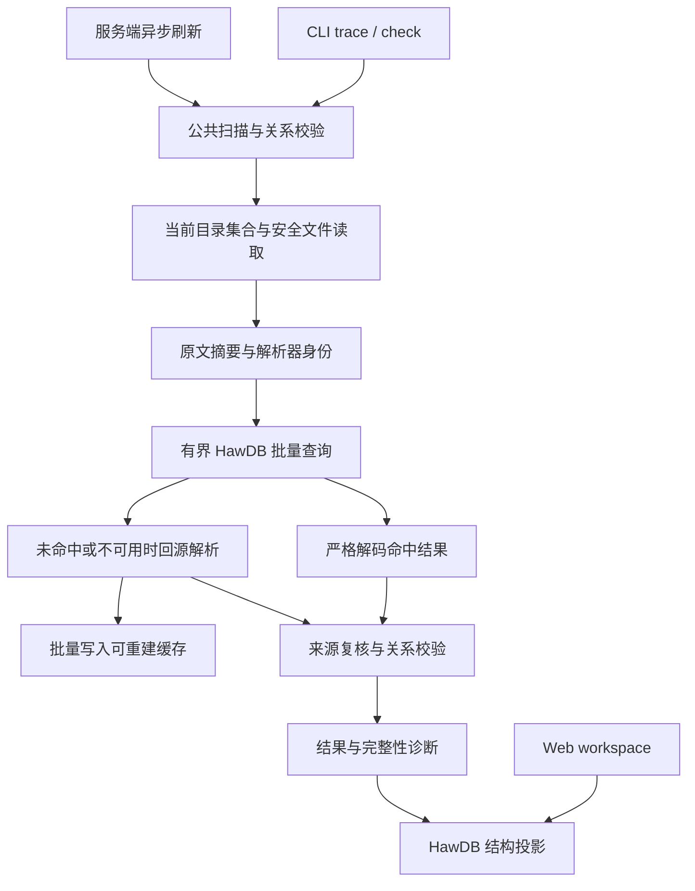

# Concord 架构与行为契约

## 目标与原则

Concord 把契约、测试归属、工程记忆与审阅闭环做成可安装到任意 Git 仓库的本地 CLI。契约先于实现，每项事实只有一个 owner，反向关系动态派生。Problem 关闭需要真实运行证据，历史不被覆盖，机器输入严格校验。

源码注释与 Markdown 拥有协作事实，HawDB 只保存可重建缓存。运行证据和事务恢复材料与缓存分开存储。跨功能规则见[宪法](constitution.md)，Web 界面设计见根目录 `DESIGN.md`。

## 初始化与项目治理

新项目生成静态 `concord.config.ts`。存在 `concord.json` 或双配置时返回 `ProjectMigrationRequired`，不执行 TS 模块，不提供格式转换入口。配置快照拥有原文前像、路径与摘要，写入、恢复与证据使用同一协议。运行时格式边界见 [TS-only 方案](design/ts-only-runtime/plans/ts-only/README.md)。

Memory 来源限于 worktree 内本地文件，canonical path 拥有身份，只读权限在 publication 统一执行。

`docs/constitution.md` 必需，可以是 draft，作者显式采用 active。Feature 与 Design 通过 constitutionRefs 声明条款，反向影响派生。宪法不充当测试契约或自动合规证据。根 `DESIGN.md` 可选。

## 领域与 CLI

`concord --root <repo>` 指定消费者，默认从 cwd 向上发现 `concord.config.ts`。`init` 只初始化显式目录或 cwd，安装目录不充当消费者根。

- `--skill [topic]`：在任意 cwd 读取随包 Agent 指引，不加载 host、不写文件。默认输出短路由和主题列表，all 展开全部。未知 topic 或混用写命令具名拒绝。
- `init`：在 Git 仓库建立 `concord.config.ts`、`docs/constitution.md`、完整分类目录、`docs/concord.md`、缺失的 `docs/README.md` 与 `docs/_template` 模板；根 `DESIGN.md` 可选。已有文件保留；待创建文件冲突时零写入失败。
- `init` 选项：`--test-root` 可重复，`--runner-config` 接受严格 runner JSON，默认是 Node 原生测试。纯文档仓库用 `--docs-only` 保存空 testRoots，与 `--test-root` 互斥。
- `feature`、`use-case`：当前目标及其叶子用户路径。
- owner `show`：返回路径、metadata、digest 与派生关系，不重复输出 Markdown 正文；Feature 汇总直属 Use Case 及其测试与实现声明。`page show` 与模板查看返回请求的正文。
- `research`：研究输入，保留安全嵌套路径；观察日期只在原文明确时记录。
- `engineering`：仓库测试与维护机制的目标、使用与验收。
- `template list/show`：在任意 cwd 查看随包写作模板，无需初始化。
- `doctor`：检查配置、缺失测试目录和当前关联，给出接入步骤，不执行 runner。
- `design create/check/format/decide/correct-reason/list/show`：候选比较、逐项检查、有限格式化、唯一裁决、受管理由更正及关联目标。
- `roadmap create/adopt/list/show`：定稿方向与显式采用。采用创建 Feature，Roadmap 标记 adopted；当前契约只在 Feature。
- `test list/show/run`：从测试源码标记派生执行引用，发现目标契约与 regression Memory；项目配置拥有 argv、附加 sourceFiles 和 timeout。
- `test annotate`：验证指定 canonical reference、归属链、类型与 anchor 后输出注释片段，regression 还验证 Problem。使用乐观 snapshot，不改源文件，不加载全局 Trace。
- `cache status/rebuild/clear`：维护可删除重建的 HawDB 缓存。
- `memory`：`add`、`index`、`list`、`show`、`recall`、`search`、`edit`、`activate`、`resolve`、`reopen`、`supersede`、`promote`、`retire`。captured 表示尚未确认当前生命周期。
- `issue`：draft、create、index、list、recall、show、edit、link、close、remove；`feedback` 提供本地反馈与 GitHub、Linear 读取接入，不执行远端发布。见 [Feedback 契约](feature/feedback/architecture.md)。
- `author set`：用完整 owner 前像 digest 更换正文，保留工具拥有的 metadata 与历史。
- `trace show/check`：构建全局关系图。show 在图不完整时拒绝，check 返回 findings 与 `complete`。不输出虚构覆盖率。
- `review render`：从契约、测试、证据和 Memory 生成本地 Markdown 审阅材料，不写 GitHub；需要完整图的结论拒绝不完整输入。
- `check`：汇总关系、生命周期和项目写作政策的 findings，不执行测试。结果与退出码由[聚合门禁](feature/documentation-quality/README.md#聚合门禁)拥有。
- `trace gaps`：派生契约与 CLI 页面的实现/测试关系缺口，见[对应 Use Case](feature/local-sdlc/use-case/inspect-relationship-gaps.md)。
- `code`、`docs`、`writing`、`concepts`、`constitution`、`page`、`config`、`repo`、`view`、`workspace`、`git`、`action`：分别由下文对应章节及链接的 Feature 拥有行为；参数以 `--help` 为准。
- `recover`：回收已死 publication token，在独占保护下恢复唯一 journal，再以短独占快照核验 journal 与 runner。runner `blocked` 使 CLI 失败退出。

## 存储契约

消费仓库使用 Markdown 加严格 YAML frontmatter。Feature、Use Case、Design、Roadmap、Engineering、Research、Memory 各有 schema 与具名操作，不公开通用 CRUD。

创建省略 `--body` 时使用随包模板，显式文件或 stdin 正文同样可用。模板是作者提示，不是完成状态或验收证据。Feature、Roadmap 和 Design 候选使用相同体裁，README 必需。

可选页面 library、cli、architecture、lifecycle 与 use-case 通过 `--pages` 选择，省略时采用项目默认，`--no-pages` 或 `pages: []` 只生成 README。未知、重复和不支持的种类明确拒绝。Engineering README 定义目标、机制、使用与验收，按主题用 page add 扩展。

Design 外层包含 GOALS、LIMITS、DECISION 和 CASES，候选放在 `plans/<alternative>/`。候选身份由主 owner 的 alternatives 声明，普通页面不新增 metadata 真源。DECISION 正文不改变 `metadata.decision` 中的裁决。

`page add/show/set` 维护已存在 package 的页面，也支持安全小写 slug 的专题页 `<slug>.md`，使用整文件 CAS。Design 候选页通过 `--plan` 选择。set 必须提供最新 digest，README 写入保留 metadata。

supporting Markdown 进入 candidate 摘要，不成为独立 owner 或测试证据。测试 contract 限于 Feature 与 Use Case；Engineering owner 可作为 Design 裁决和 Memory promotion 的目标。

模板随工具包安装，由严格 manifest 校验名称、路径、库存和文件类型，不依赖消费仓库。init 生成完整分类目录、`docs/concord.md`、`docs/_template/` 参考模板，以及缺失的 `docs/README.md`、`docs/concepts.md`、空 `docs/concepts.json` 和 `docs/architecture.md`。

根 `AGENTS.md` 由 init 保留既有正文，并追加或刷新一个带边界的 Concord 托管区块，指向 `concord --skill`。标记残缺时拒绝写入。参考模板不成为契约 owner，也不被解释为自定义配置。

路径是文档 canonical identity。测试关联是测试根里的 Concord 标记：`//`、`#` 或 `--` 开头的 `@feature <path>` 或 `@use-case <path>`，可附 `@regression`、`@status retired` 和 `@name`。标记存在即测试存在。

测试身份由文件和标记派生为 `neref_...`：有 `@name` 时用该名称，否则用契约路径加同文件序号。无需人工 ID 或 attach 步骤。反向列表由当前源码派生，不写回契约，不保存 JSON 副本。

扫描不解析宿主测试声明。JS/TS 只用注释范围排除字符串、模板和正则中的伪标记，其它文本按注释前缀认标记。缺值、同块重复契约、只有 `@regression`/`@status`/`@name` 的块产生 finding。不认识的测试写法不是 finding。

项目配置保存 testRoots、runner argv、附加 sourceFiles 与 timeout。argv 的 `{file}`、`{name}`、`{pattern}` 只按参数替换，不经过 shell；没有 `@name` 时 `{pattern}` 为 `.*`。运行收据标明 scope: command 和 selectedCaseId，不渲染为 native case passed。

HawDB 位于 Git-private `cache.hawdb`，只拥有可重建缓存。查询核对路径集合、内容摘要与解析器和 schema 身份，命中仍严格解码。损坏、schema 不符或写入失败时回源编译，不返回陈旧结果。

缓存只保存解析结果和投影，不缓存授权或 Problem fixed 判定。一次事务更新同一代投影；源文件不在事务内，通过前后摘要检测读取漂移。状态检查、clear 与 dry-run 的行为由[统一缓存 Use Case](feature/local-data-engine/use-case/use-unified-cache.md)拥有。

HawDB 的[引擎边界与预算](design/hawdb-data-engine/plans/native-embedded/README.md)区分短快照持久句柄和进程期内存句柄。配置、feedback 观察与 status 只读打开完整库，缺少 ownership 文件或命名空间不补建。持久句柄与事务先于 publication lease 释放。

文档解析、静态配置解析、代码解析及 Git 测试基线使用有界 HawDB 内存命名空间，不另存解析结果 Map。当前源文件集合和字节每次读取。配置的进程内解析命中不重新打开持久库；缓存只拥有严格解码的配置值，不拥有仓库路径验证或访问授权。

CLI 与 Web 的全局扫描共用文档 inventory、测试扫描、代码扫描与引用校验。集合解析按批读取和写入缓存，逐文件保留解析失败；大批键查询使用有界命名空间扫描后选择请求的键，单键查询保持定向读取。当前来源查询的临时结果只属于当前调用。Web 工作区导航独立读取异步结构投影，不把历史代次用于当前事实授权。缓存命中仍核对原文摘要、解析器身份和 Schema，来源前后核验保留。

同次关系图编译复用相同引用与目标类型的解析结果。读取的目标及 README 边界在返回前逐一复核字节和安全路径；变化或复核失败保留 finding，不能返回完整图。临时引用结果随本次编译结束释放，不跨请求保存。

cache clear 在独占 publication lease 下取得与 HawDB revision 相同的原生文件锁，保留目录与锁 inode。锁错误不授权删除；损坏库通过独立锁 guard 清理。clear 只管理 cache.hawdb，不删除源 owner、证据、journal 和 Memory。

Memory 保存 current promotion 与追加的生命周期 history。Problem 使用递增 epoch，reopen 增加 epoch，red 与 green 都必须绑定当前 epoch。

init 作用于 Git worktree 顶层，子目录项目与 bare repo 明确拒绝。`concord.config.ts` 是 concord.project/v1 项目标记，采用固定的 docs/feature、docs/roadmap、docs/design、docs/engineering、docs/research 约定及配置声明的 Memory 来源。

Roadmap adoption 递归复制 Markdown 页面并保留目录结构，Roadmap 保存 adopted 历史，新 Feature 拥有当前契约。内部链接指向新副本，集合外相对链接保持原目标。不能安全处理的链接、非 Markdown 附件、嵌套 owner、symlink 与目标冲突具名拒绝。

adoption 规划复查源集合与摘要，supporting source 的同内容 guard 纳入 publication，按协议原子重写并列入 changedPaths。观察到来源变化时阻止发布。

Trace 与定向 Review 按 owner 汇总 Feature supporting page 与 Use Case 的测试关系，保留 exact path 与 anchor，不用目录前缀混入相邻 Feature。默认输出供人阅读，`--json` 输出结构化结果。

读写路径拒绝绝对路径、traversal、symlink 组件和超出仓库的 realpath。扫描只读取 Concord 所属目录和格式，错误的受管格式明确报错。

## 发布协调

Git-private 状态通过 `git rev-parse --git-path concord` 定位，每个 worktree 独立；journal 绑定 projectId、root 与 privateDir。发布协调只使用 Node 文件 API，见[可移植发布协调](design/portable-publication/README.md)。

支持同主机、同 PID 命名空间内的 Linux 与 macOS 本地工作树，不保证网络多机协调与 Windows 执行。macOS 上防护大小写、Unicode 路径碰撞和 symlink。

普通来源查询不取得 publication lease。读取记录文件前像、缺失路径和目录集合，返回前验证观察集合与 publication.revision；合作发布开始与结束均推进随机代次，变化返回 SourceChanged。未完成 journal 仍阻断当前事实结果。缓存快照查询不加载来源 Repository。

普通文档写入的规划采用乐观读取，提交阶段才取得独占 publication lease，复核配置、全部观察与完整前像，写入 journal 后逐文件原子 rename。冲突拒绝覆盖；恢复和证据签发保持独占协调。显式低层写 snapshot 可保护必须串行化的状态转换，不能用于普通来源查询。

publication owner 通过临时目录 fsync 与 rename 公布，正常释放与死亡恢复只删除准确 token，不按年龄抢占，不递归删除 lease 目录。持久缓存句柄在来源快照结束前关闭，其所有权由 HawDB 保证。不同协调协议的程序不得同时访问同一 worktree。

trace show、trace gaps 与 review render 默认读取 HawDB 中已完成的诊断投影，并请求后台刷新。输出明确标记历史性、构建时间及刷新错误；首次无缓存返回 QueryPending。--fresh 等待当前来源结果。完整契约见[异步诊断投影](feature/local-data-engine/use-case/query-asynchronous-projections.md)。check、trace check、当前来源检索及证据裁决不使用历史投影授权成功。

`concord recover` 先回收已死 token，再在独占保护下选择唯一的普通或 Trace journal。多 journal 冲突先于 runner 具名拒绝并保留现场。恢复入口获锁后重查类型和现场，只在内容符合 preimage 或 planned digest 时恢复。

恢复完成后重新取得短独占快照，核验协调路径上的 journal 与 runner。init 回滚后不要求配置文件仍在。并发发布可使核验 Busy，此时 journal 结果不能称为恢复完成。返回值保留 `journalStatus` 并附带 coordination。

runner 为 blocked 时 CLI 失败退出，初次检查已 blocked 时不开始 journal 恢复。dry-run 执行同一规划校验，不发布 owner、journal 或缓存。短协调可能创建 Git-private 目录。`recover` 不接受 dry-run。

CLI 与 Web 测试共用独立 `runner.lease`，长执行不占文档 lease。run 状态区分 running、finalizing、quarantined；只有同主机活进程的 running 允许发布，且发布前持久标记该 run 失效，A→B→A 与回滚不撤销失效标记。

run 结束时在新快照中核对起止 candidate、配置、定义、契约、epoch、失效与清理结果，再写证据。父进程死亡不授权回收 runner，清理未知时保持阻断。最终快照无法取得时留下只收紧权限的 token-bound quarantine 标记。此协议不观察不合作编辑器的每次瞬时修改。

## 操作依赖与资源边界

操作依赖范围由[已采用方案](design/operation-boundaries/plans/scoped/architecture.md)定义，跨功能规则见 [C-013](constitution.md#c-013)。

局部查询按命令依赖读取 owner，使用乐观 snapshot。memory 与 issue 的列表、索引和检索读取相应来源的全部候选。精确路径编辑只取指定 owner 与当前摘要，短 ID 编辑读取该类别全部候选并要求唯一匹配。create 校验目标路径和写来源权限；Issue 还校验同类 ID，Problem 还校验证据政策。

`code annotate` 与 `test annotate` 只验证指定引用及其归属链、类型和 anchor。文档 show、trace、review 构建全局关系图；文档 show 可返回标明不完整的关系，trace show 与 review 要求图完整。

全局诊断的 inventory 携带 documents、findings 与 complete。逐文件保留解码错误的路径和具名代码，并传播 `complete: false`；单独的 documents 数组不表示集合完整。关系 show 与 Web workspace 返回 complete 及全部相关诊断。

需要完整图的结论拒绝不完整输入，requireValidTrace 同时检查 complete 和 findings。部分图不能关闭 Problem、删除 Issue 或批准关系迁移。

来源读者不创建 publication token。返回当前结果前核验观察集合与发布代次；写者在 journal 删除前推进代次，完整发布即使发生于同一个独占区间内也能被读者检测。普通提交只删除自身 owner。

未知文件、其它 exclusive token 或身份改变时保留现场并拒绝。任一活 owner、host 不匹配、EPERM、PID 复用或未知 owner 都保留现场。fsync 或核验失败时保留具名错误和可恢复现场。

recover 返回 operation、journal 结果、changedPaths 和 coordination；publication 列出 reclaimedTokens。runner 状态为 absent、running 或 blocked，blocked 带具名原因。无事务且 runner 为 absent 或健康 running 时返回 clean。

runner 不确定时返回 blocked，并保留 journal 的实际处理结果。初次检查已 blocked 时，journalStatus 为 pending 或 clean，changedPaths 为空。journal 恢复后 runner 变为 blocked 时，保留 journalStatus，总 status 为 blocked。recover 不删除 runner.lease、run state、证据或未知文件。

未完成的多文件 journal 阻断普通快照。来源扫描按当前配置和安全目录读取，文件名不推导作者 ID。协调细节见[可移植协调架构](feature/portable-coordination/architecture.md)，文档读取职责见[本地 SDLC 架构](feature/local-sdlc/architecture.md)，随包步骤由 `concord --skill recovery` 提供。

## Design 逐项比较与裁决

详细行为见[逐项比较方案并明确裁决](feature/local-sdlc/use-case/compare-design-plans.md)。GOALS 与 LIMITS 每条是带稳定 G/L 编号的 H2，候选以四列表格逐项回应。DECISION 选择的 slug 与链接须与请求及 metadata 一致，所选候选满足全部 Limit，Goal 缺口逐项解释。

`design check` 检查当前正文，普通读取及全局 check 不追溯写作门槛；正文变化不重写已有裁决。已定案的选择、目标、时间和来源保持不变；`design correct-reason` 只在 Design owner 与当前 Git HEAD 内容一致且两个 owner 的摘要匹配时更正理由，并在一个受管 Memory 中原子追加原文的 Git 提交与摘要、更正时间和说明。更正不重新运行定案门槛，也不在 Design 增加历史字段。`design format` 只整理识别出的 H2 与四列表格空白，不补充选择或证据。

定案绑定 owner、GOALS、LIMITS、DECISION 和全部候选 README 的同一次读取；同内容 guard 实际重写并计入 changedPaths，沿用 journal 恢复。repository 入口使用同一提交协调与前像，dry-run 返回前也复核完整输入。候选投影按 `metadata.alternatives` 顺序派生。裁决不证明自然语言声称的满足度。

## 测试执行和证据边界

项目配置中的运行命令是用户声明的验收单元。工具记录命令结果，不声称收集或证明底层 runner 的每个子 case，不构成正式 E2E inventory、可靠性证书或完整覆盖证明。

run 在消费者 cwd 下执行配置中的 argv，shell=false，设置 timeout；取消或超时清理进程组，信号或启动失败不记为通过。只有 run 执行仓库命令，help、list、show、check、render 均不执行。命令由项目作者信任与维护。

证据由 Concord 运行产生，以不透明 ID 保存在 Git-private 目录。收据包含 schema、scope: command、selectedCaseId、definition digest 与 contract digest。收据还记录 argv、cwd、候选摘要、起止时间、exitCode、timeout、cancel、cleanup 结果及输出摘要。

definition digest 覆盖标注、完整测试文件、runner 配置与声明 sourceFiles 的字节。候选摘要覆盖全部 Git tracked 与 nonignored untracked 文件，只排除精确识别的 Concord owner 文件；owner 不能作为测试 sourceFiles。完整性摘要用于检测意外损坏，不抵抗有本地写权限的恶意用户。

`memory resolve --kind fixed --red <id> --green <id>` 要求 active 标注的 regression 指向该 Problem，测试定义和目标契约相同。red 为普通非零退出，不是超时、信号或启动失败；green 成功且清理成功；red 先于 green；green 候选摘要匹配当前内容。

sourceFiles 是作者声明的测试、启动脚本与断言配置，工具只校验字节不变，不证明依赖闭包、断言完整性或根因。fixed 要求非空 `--reason`，resolution 持久化 evidenceLevel: command，show、check、review 与 JSON 一致显示。red 与 green 都由 CLI 签发，不导入手写 JSON。

run 前后必须校验 candidate、definition 与 contract 摘要相同，运行期间发生变化的证据不能用于关闭。摘要不证明 ignored dependencies、外部服务或执行环境。新 clone 缺少私有证据时，resolution 仍可读，check 与 review 显示 unavailable，不当作当前验证。

Memory 其他关闭理由需要非空说明。reopen 追加历史并移除 current resolution；supersede 只允许相同 kind 且不形成循环；promotion 只指向有效当前契约，不复制正文。

## 测试标记与缓存身份

测试标记 current 身份只保证当前扫描集合唯一。测试演进由 Git 保存，工具不提供跨删库、删源码的永久身份登记。证据绑定完整测试文件、路径、声明、runner 配置、契约和 Problem epoch，不能单凭同名 ID 重用。测试文件即使含标记，也完整进入 candidate 与 definition 摘要。

开发者可以直接编辑标记并以 Git 审阅，也可通过共享 `source.set` 操作替换配置范围内的 JS/TS 文件；该操作使用完整文件摘要保护和受限恢复日志。scan 与 check 不改写源文件。

文档与 Memory 的具名写命令使用同一 journal 格式，唯一提交点是全部 planned 文件发布并持久化 committed journal。缓存在源事实提交后刷新，cache 失败不回滚源文件。

测试标记不核对 runner import，不把函数名 `test` 当成测试声明。`@status retired` 的标记不能生成 fixed 证据。命令结果的 observed execution 为 unknown，或由默认 Node TAP 计数观察为 nonzero、zero、skipped。已知零执行或全跳过的收据不能用于 fixed。

缓存身份包含 projectId、worktree 的 root 与 privateDir、testRoots 与 runner 配置、完整路径集合、每文件字节摘要和解析器身份。关系验证始终使用当前 Markdown。fixed gate 从权威源码重新构建并核对，不信任缓存的状态判断。

## 代码归属声明

Code Declaration 是维护者对实现与契约关系的显式声明，源文件是唯一 owner。`implements` 边不成为测试声明、覆盖率、完成状态或 Problem fixed 证据。查询引用由[自动派生方案](design/derived-code-reference/README.md)定义。

`sourceRoots` 是可选路径数组，默认为 `[]`，沿用安全路径验证。只扫描显式根内的 JS/TS，允许与 testRoots 重叠。代码声明解析按文件缓存在 HawDB 中，键包含 worktree、解析器身份、路径和字节摘要；命中仍严格解码，摘要不符、损坏或写失败时回源。

当前事实门禁的归属、关系和 fixed 判断从当前来源计算。诊断展示可缓存带构建时间的历史关系与缺口，不授权当前裁决。扫描核对前后文件集合及摘要。未改动的配置解析可命中同一库，使后续命令不加载 TypeScript 编译器。

三种 scope：文件头 `@concord-file`；紧邻完整 AST 节点的 `@concord-code`；同一 statement-list 内连续语句的 `@concord-begin/end`。范围标记无参数，一个 scope 最多一份声明，多目标通过相邻 implements 表达。

node 白名单为有 body 的函数声明与方法、类声明，以及单 identifier 且直接 arrow 或 function initializer 的变量语句。region 不嵌套、不截断表达式、不跨语句列表，可以包含完整函数。查询返回全部包含关系，不推断覆盖或继承。

绑定与孤立标记诊断消费真实 TS comment ranges，不从纯文本行认领字符串、模板、正则或 JSX 中的伪标记。含真实代码标记且有语法错误的文件不产生有效声明。起始块内 implements 必须连续相邻，语法与位置规则见[使用指引](../skills/concord/references/code.md)。

目标支持 Feature、Use Case 与 Engineering，沿用 owner、supporting page 与 anchor 解析，只拒绝重复 exactRef。Feature 反查汇总自身与 Use Case；Engineering 汇总自身与支持页面。反查按自动引用去重，保留匹配的 exactRefs。

引用由 canonical 源路径、scope 与完整 AST 结构位置派生，不含行号、函数体或关联目标。命名节点的定位路径与同描述前序兄弟不变时，普通编辑保持引用。文件移动、改名、作用域和顺序变化可能使引用失效或复用。引用不是永久身份、CAS 或授权，调用方须重新 list 或 locate。规则见[采用架构](design/derived-code-reference/plans/derived/architecture.md)。

`code annotate` 与对应 action 不接收或返回 ID，在乐观 snapshot 中验证指定 canonical reference、归属链、类型和 anchor。`code list` 与 `code locate` 提供声明查询。Web 以符号、位置和显式关联呈现实现。无效 begin 仍参与边界检查，普通扫描不写源码。

代码错误阻断 code、check、trace、review 与 doctor。test list、show、run 与 `memory resolve` 不包含代码投影，保留全部文档、测试关系和证据校验。evidence 不接收 code 引用，候选摘要不因新注释剥离源码。

## 中立高级治理

`concord repo` 是中立的高级治理入口，方案见[中立治理](design/neutral-project-governance/plans/generalize-profile/architecture.md)。Concord 拥有声明身份、契约关系、Memory 生命周期、证据要求和权威 validator。消费者拥有 runner、原生副本与清理，以及产品构建、Preview、Examples、部署与 PR 组合。

显式 suite roots 不依赖 Nx 或 e2e 布局；静态 trace 与 Web 不加载 host，不要求 lanes 或 executor。

可靠原生要求与 command 证据严格分离。Problem 已采用的下限持久化并在所有 fixed 入口执行。新证据绑定配置、policy、adapter 实现、当前测试与契约和 epoch。red 可以绑定实际缺陷候选，green 与可靠性观察必须绑定同一修复候选。

Research、Memory、Issue 共用 `concord.document/v1` 模型。协调路径为 Git-private `concord/trace`。细节见[高级测试治理](repository-profile.md)。

## Web 工作台

`concord view` 提供随包分发的 React 工作台。Web API 与 CLI 结构化 action 共用完整应用校验，fixed 的 red/green 验证不因入口不同而省略；历史、身份和证据不能通过任意 JSON 覆盖。行为、信任边界与工作区导航投影见 [Web 工作台契约](feature/web-workbench/README.md)与[工作台架构](feature/web-workbench/architecture.md)，界面设计见根目录 `DESIGN.md`。

## 文档写作检查

写作政策、术语作用域与聚合门禁由[文档写作契约](feature/documentation-quality/README.md)拥有，规则格式见 [policy](feature/documentation-quality/policy.md)。CLI 与 Web 共用领域操作，静态命中不作为执行证据。

## 工程知识与本地观察

Memory 与 Issue 的索引、检索与更新由[记忆工具契约](feature/local-sdlc/use-case/recall-and-maintain-memory.md)与[本地观察契约](feature/feedback/use-case/manage-local-observations.md)拥有，读取范围见上文“操作依赖与资源边界”。

## 验收

独立安装包不含 `workspace:*`、外部仓库路径或运行时 import。构建产物是带 shebang 的 Node CLI，pack 为 tarball，在仓库外临时消费者安装后使用其 bin。

真实闭环：init → feature → use-case → problem → 给 Node 测试添加契约与回归注释并配置 runner → 缺陷 red → 修复 fixture → green → `memory resolve` → trace 与 review。另覆盖错误引用、无证据关闭、伪造或陈旧证据、测试源码变化、重开、退役、缓存删除与损坏、注释变化后的缓存失效、悬空与重复标注、跨 cwd 与 root、路径穿越、写冲突、并发写、journal 恢复、超时清理和独立安装。

构建脚本使用 Effect FileSystem 和 ChildProcessSpawner；测试通过 Node test adapter 执行 Effect，用 tsx 加载 TS，并纳入 typecheck。发行 tgz 携带 Linux x64/glibc 与 macOS arm64 原生产物，绑定源码、ABI、revision 和摘要；平台构建完成后统一打包，在目标平台安装同一份包验收。

`pnpm check` 构建后检查测试与脚本类型，再执行领域、恢复和 package smoke；公开 CLI 验收使用独立安装后的命令。
