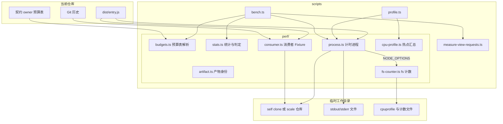

# 自举架构

全局 link 只提供稳定的公开 CLI 入口，其 realpath 指向当前 checkout 的 `dist/entry.js`。文档 mutation 必须通过该 CLI 创建 owner 或使用 digest-aware page/author 命令更新；不手写 frontmatter。

测试关系由 `test/*.test.ts` 中的注释拥有。自举 smoke 先只读解析当前项目格式、runner argv、sourceFiles 与构建版本，再把当前测试源码、Feature owner 和声明的 sourceFiles 复制到隔离 Git 消费者；扫描该副本并运行当前构建产物的 `check` 与 `trace check`，严格解码 JSON。缓存或检查副作用只发生在临时消费者，不修改当前仓库、不创建当前仓库证据，也不递归启动完整检查。

Git-private cache/evidence/journal 不提交。删除 cache 后仍可从 Markdown 与源码恢复关系；因此自举验收必须同时覆盖冷/热扫描边界和当前 owner 完整性。

## 性能测量

[性能验收](performance.md)的测量路径同样在本仓库自举：被测产物是当前 checkout 的构建，默认消费者是本仓库某个 commit 的独立 clone，预算从契约 owner 正文读取。写入范围按对象区分：入口先在当前 checkout 执行 `pnpm build`，替换 `dist/`，原生构建可能写入 `native/hawdb/target` 本地构建缓存；`self` 与 `scale` 消费者及进程输出位于临时工作目录，结束后删除（`--keep` 除外）。

路径消费者原地测量，只改动其 Git-private 目录中的可丢弃 HawDB 缓存；`--out` 指定测量或 profile 输出位置。profile 未指定 `--out` 时，在系统临时目录创建输出目录并保留。测量不修改源 owner、不写 Memory，测量者审阅记录后用 Concord 的 Memory 命令保存结论。

`scripts/perf/` 中的模块按职责划分：

- `budgets.ts` 只解析 Markdown 预算表，不访问文件系统，便于测试直接喂入 owner 正文。
- `stats.ts` 只做 p50、有效性、回退和上限判定，是纯函数。
- `process.ts` 以文件描述符重定向 stdout 与 stderr 并计时，失败使用具名 `PerfError`。
- `consumer.ts` 准备 `self`、`scale` 与路径消费者，返回带 commit 的冻结描述。
- `artifact.ts` 读取产物 commit、源码是否有未提交改动及 `dist` 摘要，摘要覆盖 `.js`、`.node` 与 `artifact.json`。
- `cpu-profile.ts` 严格解码 `.cpuprofile` 并按函数和层汇总自身耗时。
- `fs-counter.ts` 由 `NODE_OPTIONS` 预加载，包装 `node:fs` 调用后执行 `syncBuiltinESMExports()`，退出时按 pid 写出计数与 `process.resourceUsage()`；它不改变调用结果，未设置输出目录环境变量时不做任何事。

macOS 的临时目录位于 symlink 之后，Concord 会拒绝该路径；所有工作目录先取 realpath。
