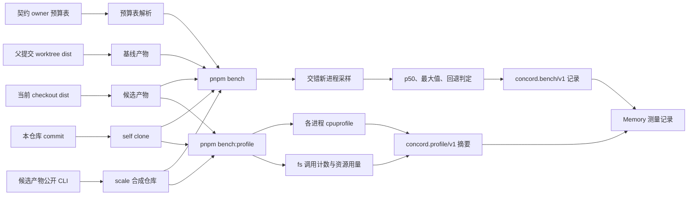

# 性能验收

本页统一规定 Concord 命令性能的测量方法、测量路径与失败判据，适用于 [C-014](../../constitution.md#c-014)。命令预算由拥有该命令的 Feature 或 Use Case 声明，当前预算见[本地 SDLC 闭环](../../feature/local-sdlc/README.md#性能预算)与[读取异步刷新的诊断投影](../../feature/local-data-engine/use-case/query-asynchronous-projections.md#性能预算)。

## 测量契约

- 参照消费者：预算表声明的本仓库 commit 的独立 Git clone，冻结后测量。每组预算绑定该 commit、完整命令参数与参照环境。
- 参照环境：预算表声明的机器与 Node 精确版本，使用构建后的 `dist/entry.js`。绝对预算只在参照环境判定；其它机器只做同机交错对照，判定回退比例。
- 测量记录：消费者 commit、纳入测量的来源及规模、基线与候选产物身份、Node 精确版本及硬件信息。
- 基线：对照时的基线是候选改动的 Git 父提交构建产物，测量前确定，不在测后挑选。两套产物在同一冻结消费者上分别预热。
- 冷暖状态：warm 表示参照消费者已执行一次同一命令、HawDB 缓存有效；cold 表示执行 `concord cache clear` 后的首次运行。预算按 warm 判定，cold 只记录。
- 计时边界：从启动 `node dist/entry.js` 进程到进程退出的 wall time，stdout 与 stderr 重定向到文件。
- 采样：先预热一次，再对每条命令运行至少 7 次全新进程，取中位数（p50）。对照测量时新旧产物交错运行。
- 统计与阈值：p50 不超过所属契约的预算，并且同机交错对照中 p50 相比基线的回退不超过 20%。
- 波动：同一命令的最大值超过 p50 的 2 倍时，该组样本无效，须重新测量；连续两组无效视为失败。
- 进程上限：契约声明为上限的命令（例如后台刷新扫描）按最大值判定，在任何机器上超出都判失败，因为超时进程的结果不会被发布。

## 预算表格式

预算只在契约 owner 中声明，测量路径读取 owner 正文，不另存预算清单。预算表是指定标题下的第一张 Markdown 表：首列以行内代码列出完整命令，每条以 `concord` 开头；末列为 `<整数>ms`。首列中不以 `concord` 开头的行内代码只作说明，不进入测量。命令参数引用的 owner 不存在于所测消费者时（以 `docs/` 开头的参数按路径检查；`trace show`、`review render` 的非路径参数按 Feature id 检查 `docs/feature/<id>/README.md`），该命令在记录中标为 `skipped` 并写明原因，不参与通过判定。`self` 消费者上出现 `skipped` 视为预算表失效，判失败。

```markdown
## 性能预算

| 基准命令（参数完整） | p50 预算 |
| --- | ---: |
| `concord trace gaps`、`concord review render local-sdlc` | 600ms |
```

| 测量路径 | 契约 owner | 标题 | 判定 |
| --- | --- | --- | --- |
| `cli` | `docs/feature/local-sdlc/README.md` | 性能预算 | warm p50 |
| `query` 读取 | `docs/feature/local-data-engine/use-case/query-asynchronous-projections.md` | 性能预算 | warm p50 |
| `query` 刷新 | `docs/feature/local-data-engine/use-case/query-asynchronous-projections.md` | 刷新上限 | 最大值 |

## 测量路径

测量与 profile 都在本仓库自举：默认消费者是当前仓库某个 commit 的独立 clone，产物是当前 checkout 的 `dist/entry.js`。两个入口先执行 `pnpm build`。profile 入口命名为 `bench:profile`，因为 `pnpm profile` 会被 pnpm 自带的同名命令截获，测量结果以 JSON 输出到 stdout，可用 `--out` 另存。

```text
pnpm bench <cli|query|view> [--consumer self|scale|<path>] [--commit <rev>] [--scale <sources>,<tests>,<pages>]
                            [--baseline <built-checkout>] [--samples 7] [--reference] [--out <file.json>] [--keep]
pnpm bench:profile refresh [trace gaps | trace show <ref> | review render [ref]] [--consumer ...] [--warm] [--out <dir>] [--keep]
pnpm bench:profile cli [--consumer ...] [--warm] [--out <dir>] [--keep] -- <concord 参数>
```

- `bench cli`：测量本地 SDLC 预算表中的命令。每条命令先在 `concord cache clear` 后记录一次 cold，再按测量契约采集 warm。表中属于异步投影的读取命令（`trace show`、`trace gaps`、`review render`）在采样前与 `bench query` 一样等待投影发布。
- `bench query`：先在前台测量刷新上限表中每条查询的内部扫描入口 `dist/query-scan-worker.js <root> <query-json>`，即后台刷新进程实际执行的扫描，按最大值对照上限。再逐条运行读取命令，直到返回已发布投影，等待不超过刷新上限加 30 秒，之后按 warm p50 采样。等不到投影时测量失败，记录最后一次输出的 `QueryPending` 及 `refresh` 详情。读取采样期间每次调用都会照常请求后台刷新，结果包含这一竞争。
- `bench view`：调用 `scripts/measure-view-requests.ts`，在其冻结 Fixture 上测量 workspace、jobs、file 与 document.set 请求，按路由分组套用相同的统计规则。
- `profile refresh`：用 V8 CPU profiler 和 fs 调用计数运行公开 CLI 的 `--fresh --dry-run` 扫描。它与 bench query 的内部 query-scan-worker 入口不同，用于定位热点，不作为刷新上限证据。
- `profile cli`：对任意一条命令做同样的 profile。

profile 通过 `NODE_OPTIONS` 注入 `--cpu-prof` 与计数模块，因此 Concord 启动的嵌套 Node 进程同样产出 profile。profile 的 wall time 含 profiler 开销，只用于 profile 之间比较，不作为预算样本。

### 消费者

| `--consumer` | 来源 | 用途 |
| --- | --- | --- |
| `self`（默认） | 本仓库 `--commit`（默认 `HEAD`）的独立 clone；未提交改动不进入消费者 | 自举预算与回退对照 |
| `scale` | 候选产物通过公开 CLI 初始化的合成仓库，按 `--scale` 生成源码、测试与支持页面后提交冻结 | 大仓库规模与刷新上限 |
| 路径 | 已有的干净 Git consumer，原地测量 | 复现外部仓库问题 |

`scale` 默认 3600 个源码文件、600 个测试文件、1000 个支持页面，对应已接入的大型游戏仓库规模。源码文件带 `@concord-file` 与 `@concord-implements`，测试文件带 `@use-case`，支持页面链接到所属 Feature，使扫描覆盖文档、测试与代码归属三类来源。`self` 与 `scale` 消费者准备完成后执行一次 `concord cache rebuild`，并以 `cache status` 确认为 `ready`，记录中 `consumer.cache` 为 `ready`；否则测量失败，因为没有有效缓存时 warm 样本实际是 cold。原地测量的路径消费者必须没有未提交改动；测量只改动可丢弃的 HawDB 缓存，`bench cli` 会清空该缓存。

### 基线

`--baseline` 指向一个已构建的 Concord checkout，通常是候选改动父提交的独立 worktree：

```sh
git worktree add ../concord-baseline HEAD^
pnpm --dir ../concord-baseline install --frozen-lockfile
pnpm --dir ../concord-baseline build
pnpm bench cli --baseline ../concord-baseline
```

省略时只测候选产物，判定只包含样本有效性、刷新上限，以及声明 `--reference` 时的绝对预算。



## 测量记录

`concord.bench/v1` 记录一次测量路径的全部判定，用两个字段区分诊断结论与验收结论：

- `pass`：没有任何判定失败。为 false 时进程退出码为 1。
- `acceptance`：可作为预算验收证据。仅当 `pass` 为 true、每组至少 7 次样本、全部样本组有效，且声明了 `--reference` 或提供了 `--baseline` 时为 true；否则为 false，并在 `acceptanceGaps` 列出缺少的条件。

`acceptanceGaps` 按条件依次包含 `failed verdicts`、`samples < 7`、`invalid sample groups`、`no baseline and not reference`。未命中任何条件时不输出该字段。

交付验收引用 `acceptance` 为 true 的记录；`pass` 为 true 而 `acceptance` 为 false 的记录只用于定位。

```json
{
  "format": "concord.bench/v1",
  "path": "query",
  "environment": { "node": "v24.19.0", "platform": "darwin", "arch": "arm64", "cpu": "Apple M4", "cpuCount": 10, "memoryBytes": 34359738368 },
  "reference": false,
  "samples": 3,
  "consumer": { "kind": "scale", "cache": "ready", "commit": "4f0c…", "scale": { "sources": 3600, "tests": 600, "pages": 1000 } },
  "artifacts": [{ "label": "candidate", "commit": "2241a72…", "dirty": false, "digest": "sha256:…" }],
  "verdicts": [{
    "command": "concord --json --fresh --dry-run trace gaps",
    "limitMs": 120000, "limitKind": "max", "withinLimit": false,
    "candidate": { "samples": [178000, 176500, 177000], "p50": 177000, "max": 178000, "valid": true },
    "pass": false, "reasons": ["max 178000ms exceeds 120000ms"]
  }],
  "snapshots": [{ "command": "concord trace gaps", "artifact": "candidate", "lastError": "{\"ok\":false,\"error\":\"QueryPending\",…}" }],
  "pass": false,
  "acceptance": false,
  "acceptanceGaps": ["failed verdicts", "samples < 7", "no baseline and not reference"]
}
```

`concord.profile/v1` 按进程列出 CPU 自身耗时最高的函数、按层（`dist/<模块>`、依赖包、`node:internal`、原生）汇总的耗时，以及 user/system CPU、最大 RSS 和各 `node:fs` 调用的次数与同步耗时。原始 `.cpuprofile` 留在输出目录，可用 Chrome DevTools 或 speedscope 打开。

```json
{
  "format": "concord.profile/v1",
  "path": "refresh",
  "command": ["concord", "--json", "--fresh", "--dry-run", "trace", "gaps"],
  "wallMs": 181204,
  "processes": [{
    "pid": 41872,
    "resources": { "userMs": 82470, "systemMs": 100380, "fs": { "lstatSync": { "count": 1843210, "ms": 61210 } } },
    "layers": [{ "name": "node:internal", "selfMs": 64012, "share": 0.36 }],
    "functions": [{ "name": "lstatSync node:internal:1520", "selfMs": 58120, "share": 0.33 }]
  }]
}
```

示例中的数字只说明字段形状，不是测量结论。

## 失败判据

超出预算或上限、回退超过 20%、样本无效或缺少必需测量证据，都不能判为通过。命令的输出、退出码与失败边界必须与优化前一致，不能以跳过校验换取时间。

测量结果、阶段分解与 profile 结论保存在 Memory；本页只声明方法与路径。`test/cli-startup.test.ts` 保护只读命令的模块加载范围，预算表解析与统计规则由测试覆盖；Node 测试不断言绝对耗时，`pnpm check` 不运行测量路径。
